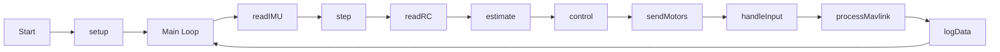

# Flix Flight Controller Execution Flow Analysis

## Main Loop Execution Flow

## Key Functions

### 1. `readIMU()`
- Reads data from IMU sensor
- Updates `gyro` and `acc` variables
- Handles IMU calibration if needed

### 2. `step()`
- Updates time variables
- Handles main control loop timing

### 3. `readRC()`
- Reads RC receiver data
- Normalizes channel values
- Updates `channels[]` and `controls[]` arrays

### 4. `estimate()`
- Estimates current state (attitude, position, etc.)
- Updates `attitude` quaternion

### 5. `control()`
- Implements flight control algorithms
- Calculates motor outputs
- Updates `motors[]` array

### 6. `sendMotors()`
- Sends PWM signals to motors
- Handles motor arming/disarming

### 7. `handleInput()`
- Processes serial commands
- Handles CLI interface

### 8. `processMavlink()`
- Handles MAVLink communication
- Processes incoming messages
- Sends telemetry data

## Watchdog Trigger Points

1. **Blocking Loops**:
   - `while (!readRC())` in `calibrateRC()`
   - `while (t - start < duration)` in `pause()`

2. **Long Operations**:
   - IMU initialization and calibration
   - RC calibration
   - Heavy logging operations

## Recommendations

1. Add `yield()` in long loops
2. Implement timeouts for blocking operations
3. Break down heavy operations into smaller chunks
4. Add proper error handling for sensor initialization
5. Implement watchdog reset points in critical sections
